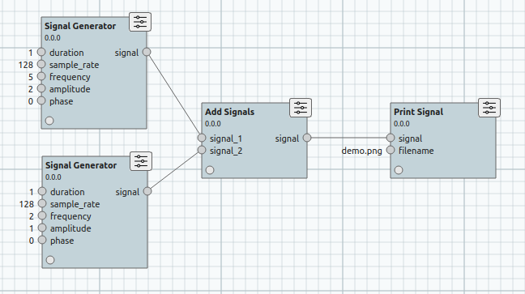
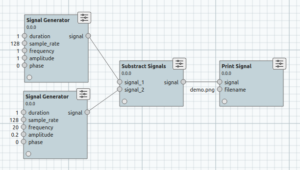
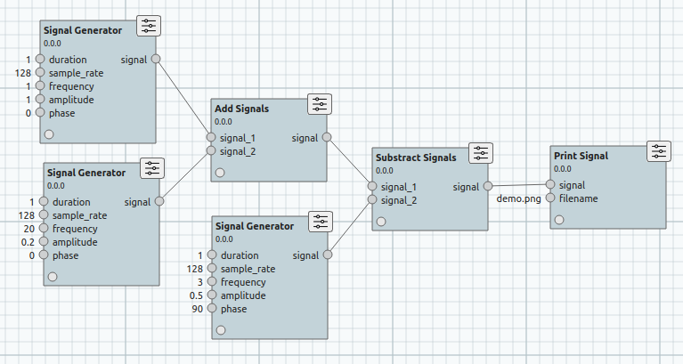

# README

Welcome to the snooz-package-template repository. The purpose of this repository is to provide the necessary tools and code for creating new modules and tools in the Snooz software. This README assumes that you have a configured developer environment for Snooz. Make sure your developer environment is set up before proceeding.

Documentation to configure the developer environment : https://snooz-toolbox-documentation.readthedocs.io/dev_guide/installation/installation.html  

Documentation to run Snooz from the source code : https://snooz-toolbox-documentation.readthedocs.io/dev_guide/run_snooz.html

## Table of Contents
- [Installation](#installation)
- [Importing a package](#importing-a-package)
- [Working with tools](#tools)
- [Working with processes](#process)
- [Working with modules](#modules)
- [Working with packages](#packages)
- [What's next?](#whats-next)

<a id="installation"></a>

## Installation
### Add this repository to your Snooz workspace

The first step is to add this repository to your Snooz's workspace. This will allow you to debug your new modules and tools.

- Open Snooz's workspace in Visual Studio Code.
- Go to **File->Add Folder to Workspace...**
- Select the folder where you cloned this repository.

You should see a new folder called "snooz-package-template" in your explorer tab in Visual Studio Code.


### Select the python interpreter for the snooz-package-template folder

You need to specify which Python interpreter to activate when working in a terminal (which you will do in a moment).

- Open Snooz's workspace in Visual Studio Code.
- Open the **Command Palette** (Ctrl+Shift+P or View->Command Palette...)
- Select **Python: Select interpreter**
- Choose the **snooz-package-template** project.
- Select the Python version from the virtual environment you created for (snooz_310_env).


<a id="importing-a-package"></a>

## Importing a package

In Snooz, modules and tools are organized into packages. This repository comes with all the tools necessary to create new modules, tools, and packages. But first, let's see how the importing process works by adding the example packages.

- Open Snooz's workspace in Visual Studio Code.
- **Press F5** to launch Snooz.
- In Snooz, select **File->Settings**.
- In the **Packages** tab, click on **Add from folder**.
- Navigate to the folder of this repository and select **./modules/ExampleModulesPackage**.
- Repeat the steps to also include the folder **./tools/ExampleToolsPackage**.


As their name suggests, ExampleModulesPackage contains a list of modules and ExampleToolsPackage contains tools that use those modules.

Once this is done, you should find a new tool under the **Examples** menu in Snooz called **Signal Generator**.

<a id="tools"></a>
## Tools
### Try out the Signal Generator tool.

To explore the current examples with the official documentation go to : https://snooz-toolbox-documentation.readthedocs.io/dev_guide/explore_ex.html

Open the Signal Generator tool. This is a demo tool used to create a signal and export a preview in a PNG file. The user can configure two different signals that can be added together to create the resulting signal.
- In Snooz, select **Examples->Signal Generator**.

This will open the Signal Generator tool. The tool consists of four configuration steps: 
1. **Intro step** explains what the tool is.
2. **First signal** parameters step.
3. **Second signal** parameters step.
4. **Output step** sets the output filename.

> This step-by-step interface is the UI format of all tools. Each tool will define a series of configuration steps, and once the user is satisfied with its settings, they press the **Run** button to execute the process behind the tool.

<a id="process"></a>
## Process

A tool is a user-friendly abstraction layer sitting above a **process**. When the user presses **Run** in the step-by-step interface, it's the process that is being executed. To look at the process behind a tool, just select the **Process** button in the vertical navigation bar on the left (third one).



As you can see for the Signal Generator tool, the process is composed of two SignalGenerator modules, an AddSignal module, and a PrintSignal module. As mentioned above, this process doesn't require the step-by-step interface to work. The step-by-step interface is just a user-friendly way to configure each module.

### Creating a process
Let's explore how to create a process by using the same modules as the Signal Generator Tool.

- In Snooz, select **Dev Tools->New process**.

> If you don't see the Examples category in the Module Library, click on the **Options** button and check the packages ExampleModulesPackage 0.0.0 and ExampleToolsPackage 0.0.0.

- Drag the modules from the **Examples** category to reproduce the same process as the Signal Generator tool shown above.
- Connect the outputs with the inputs by clicking on the circle and dragging the link to the input.

Your new process is now ready to be executed. Save it and run it.

- To save the process: go to **Dev Tools->Save process as**.
- To execute the process: go to **Dev Tools->Run** (or press Ctrl-r).

### Configuring a process
Configuring a process is the task of configuring every modules instanciated in the process. 
To configure an instanciated module, double-click on the module itself. This will open a dialog with three tabs: **Settings**, **Results**, and **Logs**. The **Settings** page contains text fields for every input. The **Results** is used to display information about the last run of the module. The **Logs** tab displays any log associated with this module (very useful when your module crashes).

> Note that the settings page you see when double-clicking on the SignalGenerator module is the exact same interface as the second and third steps of the **Signal Generator** step-by-step tool. In fact, it is the exact same code. You can reuse any **Settings** page as a step for a tool. This saves a lot of development time as you only need to do it once, and you can then use the interface in any step-by-step tool that uses that module. We'll go into more detail on how to do that in a later section.

Once the process is configured to your liking, save and run it to see the results. You will find that as you create new modules, you will be creating a lot of different processes to test your modules. It's not necessary to create a step-by-step interface for these processes, just save the **JSON** file of the process, and you can reuse it whenever you need.

<a id="modules"></a>
## Modules

Modules are at the core of Snooz. All computations are done within a module's **compute(...)** function. This function will receive input as parameters and must return an object for the output.

### Debugging a module
All you need to debug a module is to add a breakpoint in its compute function and run a process with your module in it. When the process reaches your module, it will call the compute function, and you'll be able to step through it using the Visual Studio Debugger tool.

1. Open your Visual Studio workspace.
2. Navigate to the compute function of the GenerateSignal module: snooz-package-template/modules/ExampleModulesPackage/GenerateSignal/GenerateSignal.py
3. Add a breakpoint to the compute function by clicking in the left margin of the file.
4. **Press F5** to launch Snooz.
5. Open the **Signal Generator** tool.
6. Configure it.
7. Press **Run** in the tool UI (or Ctrl-r) to execute it.

> Note that you don't need to use a tool to debug a module. You can also create a new process and only add your module to it. As long as the input values are valid, you'll be able to debug your module.

### Creating a new module

In this section, we will be creating a new module to subtract a signal from another and output the resulting signal. The procedure will be the same for any other modules you may want to create. Let's first define the module's attributes:

	Name: SubtractSignals
	Label: Subtract Signals
	Category (for the menu): Examples
	Input1: main_signal
	Input2: signal_to_substract
	Output1: signal

#### Open the main python utility
We use a command line tool to help create new modules and tools. This makes the process much easier than writing all the necessary files from scratch.

1. Open the terminal in Visual Studio Code: **Terminal->New terminal**.
2. Select **snooz_template_package**.

This should open a new terminal with the correct python virtual environment activated (snooz_310_env).

1. Type `python main_utils.py`
2. Select `2- Create a module`
3. Type `ExampleModulesPackage` (This will create a subfolder under that package folder).
4. Fill the rest with the information from above. If you make any mistakes, just repeat the steps and it will ask to overwrite the previous one.

As the message in the console mentions, there's a final step before you can use the module in a process. You need to generate the python files associated with the two .ui files of the module. In Visual Studio Code:

1. Find the new subfolder of your module.
2. Right-click on file **Ui_SubstractSignalsResultsView.ui**
3. Select **Compile Qt UI file**.
4. Repeat the process for the file **Ui_SubstractSignalsSettingsView.ui**

Now if you open the subfolder **modules/ExampleModulesPackage** you'll see a new folder called **SubstractSignals**. Open it, and you should see these files:

<table>
  <thead>
    <tr>
      <th>Filename</th>
      <th>Description</th>
    </tr>
  </thead>
  <tbody>
    <tr>
      <td>__init__.py</td>
      <td>The __init__.py file in a Python package serves to indicate that the directory should be treated as a Python package.</td>
    </tr>
    <tr>
      <td>description.json</td>
      <td>The attributes of the module in JSON format. This is used by Snooz to understand how to use this module in a process. If at some point you need to change your inputs or outputs, you'll need to modify this file.</td>
    </tr>
    <tr>
      <td>SubstractSignals.py</td>
      <td>This is where the actual work of the module takes place. The compute function will be called when the module needs to be executed in a process. The parameters of the compute function are the input values of the module and the return object is the output.</td>
    </tr>
    <tr>
      <td>SubstractSignalsResultsView.py</td>
      <td>The class implementation of the "result" tab when you double click on a module in Snooz. Used to show any kind of data resulting from the compute function of the module. It's often used to debug a process to see how the module behaved.</td>
    </tr>
    <tr>
      <td>SubstractSignalsSettingsView.py</td>
      <td>The class implementation of the "settings" tab when you double click on a module in Snooz. Used to manually set the input values of the module.</td>
    </tr>
    <tr>
      <td>Ui_SubstractSignalsResultsView.ui</td>
      <td>.ui files are XML descriptions of a UI. This file is used by Qt Designer, a WYSIWYG tool for creating user interfaces in Qt. You won't modify this file directly, only through Qt Designer. This is the one for the "Results" tab.</td>
    </tr>
    <tr>
      <td>Ui_SubstractSignalsSettingsView.ui</td>
      <td>.ui files are XML descriptions of a UI. This file is used by Qt Designer, a WYSIWYG tool for creating user interfaces in Qt. You won't modify this file directly, only through Qt Designer. This is the one for the "Settings" tab.</td>
    </tr>
    <tr>
      <td>Ui_SubstractSignalsResultsView.py</td>
      <td>The Python file generated from the .ui file of the same name. This file is generated by the steps described previously and must be regenerated every time there is a change to the associated .ui file.</td>
    </tr>
    <tr>
      <td>Ui_SubstractSignalsSettingsView.py</td>
      <td>The Python file generated from the .ui file of the same name. This file is generated by the steps described previously and must be regenerated every time there is a change to the associated .ui file.</td>
    </tr>
  </tbody>
</table>

> Note that the tool generates a default **Settings** page to configure your module. In this case, it's not very useful as the input must be linked to the output of a GeneratorSignal module. But in other cases, it's often useful to have a basic settings page ready to go.

#### Change the compute function
Open the SubstractSignals.py file and change the compute() function for the following code:

```
def compute(self, main_signal,signal_to_substract):
  # Make appropriate checks to input values
  if not isinstance(main_signal, dict):
      raise NodeInputException(self.identifier, "main_signal", "main_signal must be a dictionary")
  if not isinstance(signal_to_substract, dict):
      raise NodeInputException(self.identifier, "signal_to_substract", "signal_to_substract must be a dictionary")
  
  if 'samples' not in main_signal or 'samples' not in signal_to_substract:
      raise NodeInputException(self.identifier, "samples", "main_signal and signal_to_substract must contain 'samples' key")

  if 'sample_rate' not in main_signal or 'sample_rate' not in signal_to_substract:
      raise NodeInputException(self.identifier, "sample_rate", "main_signal and signal_to_substract must contain 'sample_rate' key")
  
  if main_signal['sample_rate'] != signal_to_substract['sample_rate']:
      raise NodeInputException(self.identifier, "sample_rate", "Sample rates of both signals must be the same.")

  # Determine the lengths of the signal samples
  len_main_signal = len(main_signal['samples'])
  len_signal_to_substract = len(signal_to_substract['samples'])

  # Extend the shorter signal with zeros
  if len_main_signal < len_signal_to_substract:
      main_signal['samples'] = np.pad(main_signal['samples'], (0, len_signal_to_substract - len_main_signal), 'constant')
  elif len_signal_to_substract < len_main_signal:
      signal_to_substract['samples'] = np.pad(signal_to_substract['samples'], (0, len_main_signal - len_signal_to_substract), 'constant')

  # Perform the addition of the signals
  result_samples = main_signal['samples'] - signal_to_substract['samples']

  # Create the output signal dictionary
  output_signal = {
      'samples': result_samples,
      "sample_rate":main_signal['sample_rate']
  }

  return {'signal': output_signal}
```

> Note the use of the NodeInputException. This exception is used when there is a problem with the input of a module. If it happens, Snooz will stop immediately and inform the user that a problem has occurred in the process. You'll be able to see a trace of the log in the **Logs** tab of the module.

Add ``import numpy as np`` at the beginning of the SubstractSignals.py file since numpy is used to pad the signal.

#### Test your module
Follow these steps to test your new module:

1. Press **F5** to launch Snooz.
2. Create a new process: **File->New**
3. Add two **SignalGenerator** module.
4. Add your new **SubstractSignals** module.
5. Add a **PrintSignal** module.
6. Connect them like this:



7. Configure each modules to your liking.
8. Select **Dev Tools -> Run** (or Ctrl-r) to execute it.

#### Play around with your new module
Now that we have modules to add and substract two signals, we can create some more complex process like the following example:



> Creating a new module for each mathematical operation is not optimal. If you are up for the challenge, create a new module (**SignalOperation**) that will also take the type of operation as an input value and execute that operation in its compute function.

<a id="packages"></a>
## Packages
### Creating a new package

Now that you know how to create a module, the next step will be to create your own package.

1. Open the terminal in Visual Studio Code: **Terminal->New terminal**.
2. Select **snooz_template_package**.

This should open a new terminal with the correct python virtual environement activated(snooz_310_env).

3. Type `python main_utils.py`
4. Select `1- Create a package`
5. Fill the information.

You can now find your new package under the tools or modules subfolder. From this point you can create new modules and tools into this package.

> Note that you can move a module or a tool to another package, but you'll need to modify the **json** file of the old and new package.

<a id="whats-next"></a>
## What's next?

Congratulations, you are now set up to start making new modules and tools for Snooz! 

There is still a lot to learn about the Snooz software and how to develop modules and tools for it. 

Here the documentation for the Hows Tos : https://snooz-toolbox-documentation.readthedocs.io/dev_guide/howtos/howtos.html

To have more information about the Snooz architecture, see : https://snooz-toolbox-documentation.readthedocs.io/dev_guide/information/information.html

For the Versioning Guidelines, see : https://snooz-toolbox-documentation.readthedocs.io/dev_guide/information/information.html#how-module-tool-and-package-versioning-works

